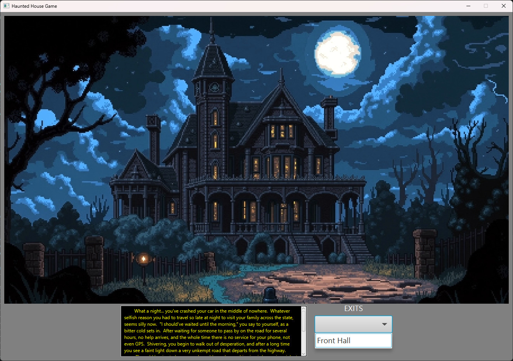
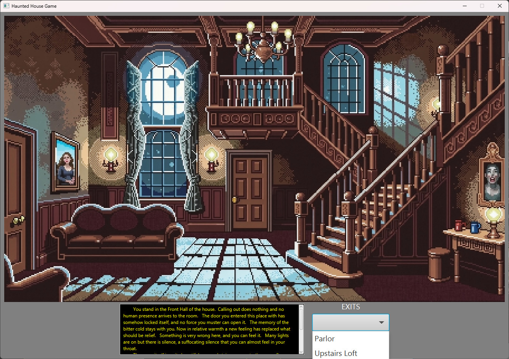

# Haunted House Project - Version 1.0.0 (Archival Repository)

Welcome to the historical v1.0.0 repository of the Haunted House Project. This standalone repository serves as the absolute baseline build of the project, preserved exactly in its original state to document the initial logic layout, mechanics, and design milestones before subsequent major refactors.

A JavaFX-based exploration game where players navigate a series of ambient, pixel-art rooms in a mysterious mansion, experiencing script-triggered events and animations.

## Screenshots
| Screenshot 1 | Screenshot 2 |
| :---: | :---: |
|  |  |

## Project Purpose & Context
This game was originally developed as the final project for CSCI 1112 at STECH. It was built to demonstrate an early mastery of core Java programming concepts, object-oriented structure, user interface creation using Open JavaFX, and multimedia playback integration.

In this initial phase, the game is structured as an open-ended exploration engine; it does not feature an ending or win condition, allowing continuous navigation through the house until the window is closed.

---

## Features & Visual Design
* Atmospheric Pixel Art: Visual designs use AI-generated pixel art environments to establish a retro, immersive horror setting.
* Bottom UI Navigation: Room exits are populated dynamically using a ComboBox tracking component pinned to the bottom of the interface.
* Dynamic Media Streaming: Features native audio looping logic powered by the javafx.media module to maintain a continuous background soundtrack.
* Scripted FX Animations: Employs synchronized JavaFX FadeTransition animations, including a localized light-flickering routine in the Kitchen and independent opacity-scaled ghost spawns in the Washroom and Upstairs Loft.

---

## Project Structure (At a Glance)
* Main.java: The main application entry point that initializes the primary stage, constructs the UI node hierarchy, coordinates room updates, and drives event triggers.
* Room.java: A clean, encapsulated data model that defines explicit structural values for each environment, tracking its name, description text, image resource location, and selectable exit routes.

---

## Archival Installation & Execution Notes

### Prerequisites
* Java 17 or higher.
* JavaFX SDK configured on your system modules path.

### Option 1: Running via an IDE
1. Clone this baseline repository:
   git clone https://github.com/your-username/HauntedHouse-v1.0.git
2. Open the directory as a project in an IDE (such as IntelliJ IDEA or VS Code).
3. Add the following VM arguments to link the JavaFX SDK controls and media dependencies during compilation:
   --module-path "<path_to_javafx_sdk_lib>" --add-modules javafx.controls,javafx.fxml,javafx.media
4. Compile and run Main.java.

### Option 2: Running the Built JAR
A pre-compiled runnable archive is included directly in the root directory. Due to classpath adjustments in this early milestone build, audio playback is disabled during JAR execution.
1. Open a terminal and navigate to the repository directory.
2. Execute the JAR by targeting your local JavaFX directory path:
   java --module-path /path/to/javafx-sdk/lib --add-modules javafx.controls,javafx.fxml -jar Haunted_Game.jar

---

## 🚀 The Development Timeline
To see how this project evolved across different architectural stages, visit the other iterations in this progression index:
* **The Absolute Baseline:** [HauntedHouse-v1.0](https://github.com/c-stech-carter/HauntedHouse-v1.0) — The original prototype utilizing a bottom ComboBox menu system for navigation and native multimedia tracks driven straight out of Main.java.
* **The Current Milestone:** [HauntedHouse-v2.0](https://github.com/c-stech-carter/HauntedHouse-v2.0) — Introduces centralized GameWindow staging, a context-aware right-click menu system, interactive room searching, and an encapsulated inventory tracking system.
* **The Final Production Build:** [HauntedHouse-Release](https://github.com/c-stech-carter/HauntedHouse-Release) — Features complete project modernization with Gradle build automation, secure classpath resource mapping, and an optimized standalone bundle configuration.

***

### Snapshot Date: November 2024 - CSCI 1112 Milestone
